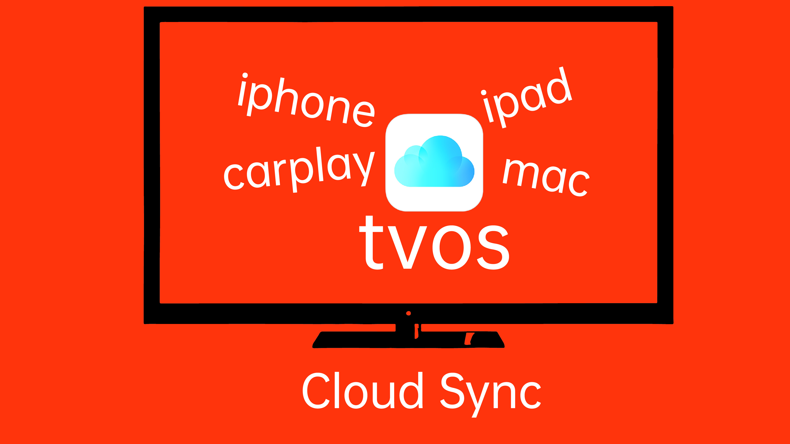

# YinHu Music

---

## Main Features

- Browse and play music from your Jellyfin server
- Siri voice control (e.g., "Play songs by xxx")
- Full CarPlay support for seamless in-car music
- Available on macOS, iOS, and tvOS
- Lyrics display, album art, and queue management
- Multiple accounts and server switching
- High-quality audio playback and multi-format support
- Playback history, favorites, and smart recommendations

---

## Download

Search for "YinHu Music" on the App Store or download directly:  
[https://apps.apple.com/us/app/音狐音乐/id6738853540?l=zh-Hans-CN](https://apps.apple.com/us/app/%E9%9F%B3%E7%8B%90%E9%9F%B3%E4%B9%90/id6738853540?l=zh-Hans-CN)

---
